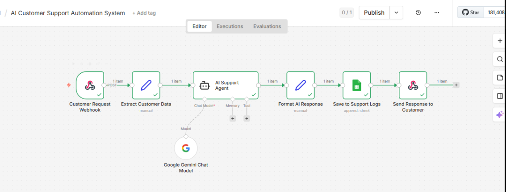

# 🤖 AI Customer Support Chatbot (n8n)

## 🚀 Overview
This automation is designed to handle customer support queries automatically using AI.

It receives customer messages, generates intelligent replies using AI, and sends responses instantly — saving time and improving support efficiency.

---

## ⚙️ Tools & Technologies
- n8n (Workflow Automation)
- Google Gemini (AI)
- Google Sheets (Data Logging)
- Webhook / API

---

## 💡 Features
- ✅ Auto-replies to customer messages
- ✅ AI-generated smart responses
- ✅ Stores all queries in Google Sheets
- ✅ Works 24/7 without manual effort
- ✅ Scalable for eCommerce & businesses

---

## 🔄 Workflow Process
1. Customer sends a message (via webhook/email)
2. Data is processed inside n8n
3. AI (Gemini) generates a response
4. Response is sent back to the customer
5. Query is saved in Google Sheets

---

## 📸 Workflow Screenshot

---

## 🎯 Use Cases
- eCommerce customer support
- SaaS support automation
- Small business automation
- Lead response systems

---

## 🚀 Benefits
- Saves time on manual replies
- Improves response speed
- Enhances customer experience
- Reduces support workload

---

## 📌 Author
Zoha Aslam  
Automation Specialist (n8n | AI | Shopify)
